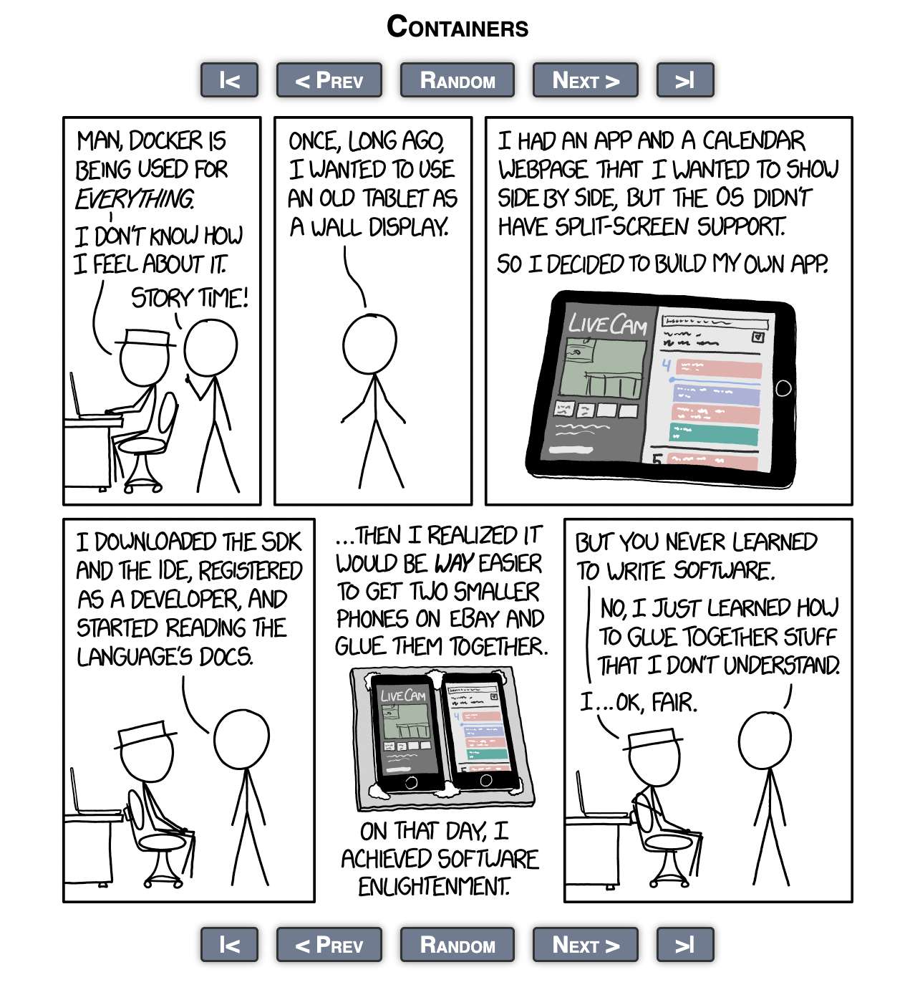

# docker + docker-compose
> a no-frills introduction to containers and container technology by J

## Overview
1. Who is J?
2. What are containers and why should you care about them?
3. How to implement containerization in your next project
4. How to easily manage containers (Intro to docker-compose)
5. Demo
6. Additional Resources
7. Thank You's

## Who is J?
i am! next question. haha, only kidding.

*ahem*

hello friends! my name is Jay and i'm a software engineer at
[care.coach](https://care.coach). i joined A/a's 16 wk program in june of 2022
and have been at my current company for a year now. in my past life i was a
3rd grade teacher and later a medical school student. i'm a volunteer
instructor [@Code Tenderloin](https://www.codetenderloin.org/code-ramp-course),
i like to help growing programmers grow, and i <3 pickup bball! feel free to
connect with me on twitter/X [@J_SON_Reddy](https://twitter.com/J_SON_Reddy) or
[LinkedIn](https://www.linkedin.com/in/jay-reddy-69538b240/) and i'm happy to
share my story and hear yours. lots of people helped me on this journey and
i am but a singular node in a long linked list of pay it forward - node.next'ing
through space and time all the way over to you!

now, let's talk containers so you can resume.skills.push("docker", "docker-compose")

## What are containers and why should you care about them?
containers are *virtual* bundles that wrap your application and all of its
dependencies together into a standardized unit for software development. this
process ensures that your app runs consistently across various environments.

consider the following scenario:

you toil day and night to build an application for a take-home project. you submit
said project and finally get a good night's sleep. to your horror, you wake up
the next morning to an email from the recruiter saying that the engineer
couldn't run your project.

*enter meme: "it works on my machine!" - credits: Don't Hit Save*


any number of things could have gone wrong: was there a dependency clash btwn
the engineer's local environment and yours? were the ports that you deployed
your services to already occupied on their machine? were they running 128 browser
tabs and they didn't have sufficient memory to run your app? WHAT HAPPENED?!

containerization is a solution to the above problem. thanks to virtualization,
the container allows for *process-isolation* meaning that to your app inside
of the container, there are no other processes running. so, the system's state
will not affect your application inside of a container as much as it would otherwise.
note the wording: *as much as*. containers still use the host machine (your machine's)
resources however they do so in significantly more isolation than running on your
machine without containerization.

you might be wondering: well, can't i just install and run a virtual machine on
my machine and then i have significant process-isolation? that's a good idea; but,
keep in mind that you also need your virtualization solution to be *portable* (so
you can send it in with your take-home project) and *lightweight* so the overhead
of virtualization doesn't affect your app's performance. containers are often
preferred to VM's because the software to manage them is comparatively lightweight
and portable - this is partly due to the fact that containers share their host
machine's OS kernel whereas a VM will spin up a completely new OS instance and
virtualize the entire hardware stack: CPU, memory, disk, network interface, etc..

docker is a lightweight, portable containerization solution and the industry standard
when it comes to using containers. many software products that are developed enough
to reach consumers are using docker. and so, it'll serve you well to learn how to
build and coordinate multiple containers at once.

lastly, while some companies are considering the comparative financial implications
btwn microservice vs. monolithic architecture, microservices continue to dominate
the industry. and where do microservices thrive? in docker containers. each microservice
is typically encapsulated in its own container, providing the isolation and independence
that define the microservice architecture.

*xkcd on microservices/docker:*


don't let the hat person's criticism deter you! the modern engineer spends
just as much time making sure independent services are "glue(d) together" well
as they do writing code and that is more a reflection on modern software infra
than our leet hax0r skillzzz :P; and, you having familiarity with glueing(sp?)
software together will advantage you in the job battlefield!

## How to implement containerization in your next project
[first off, we gotta install docker](https://docs.docker.com/get-docker/)

once you've successfully installed docker (and docker-compose - it comes with
every Docker Desktop bundle) check to make sure you've successfully downloaded
the two binaries and they're on your sys PATH with:

```docker --version```

```docker-compose --version```

the version won't matter too much for the purpose of this exercise but generally
you'd want your docker version to be >= 20.\*.\* and your docker-compose version
to be >= 2.\*.\*

and last thing before we get into writing our Dockerfile, docker itself has a great[
'getting started' tutorial](https://docs.docker.com/get-started/) that you should
check out. it's quick and dirty if you want to just containerize an app and be done
with it. i would say this tutorial that you're reading now aims to go "one level deeper"
so that you feel comfortable understanding the engineering decision-making around docker
and can discuss it in an interview setting as well as implement it in a project while
the docker 'getting started' tutorial wants to quickly get you on the ground running and
using docker.

---

alright, lets get into it!

*docker taxonomy - credits: Microsoft Learn:*


the above img might seem daunting at first but don't focus on understanding all of it
immediately. we're going to break it down into the parts relevant to our interests.

in docker terminology, *images* are static blueprints of software that you use
to deploy a container on your machine. the image has all the details of how to build
a container which will be a virtual package of software as we touched on earlier.
so, a container is actually a *runtime instance* of an image. the image is the set of
instructions on how to build the container with all of the specifications, like comparing
a recipe to a dish: the image is the recipe and the container is an instance of a recipe
\- a dish. another comparison for the OOP-infatuated programmers among us, an image
is very much like a class, whereas a container is like an instance of that class.
a class definition in itself doesn't *do* anything; and, you cannot have an instance
of a class without a class definition.

so, in order to containerize our application, we need to *build* an image that tells
the docker software the recipe for our containerized app. but J, how are we going to
specify basic things like what OS to run our app in and using what language/version
e.g. (Ubuntu 20.0.4, python3.8)? great question, anon! this is where the idea of a *registry* comes in.
registries are storage for docker *images*. the most common public registry is
[Docker Hub](https://hub.docker.com/search?q=) and here there are countless docker images
for us to download via docker, add our application to, and then use to make a container.
you may quickly notice that many of the popular images have more than 1 billion downloads.

i want you to take special note of the order of operations in that last sentence.
when we download an image that contains foundational blueprints like an OS or
a programming language, we call that image a *base* image. as part of our docker workflow,
we will download a base image and add the necessary code to build and run our app, thus
creating a __new image__. remember, conceptually (and actually, lol), images are static.
so, when we add our application code to a base image, we are building a new image \- this
is sometimes called a *child* image or a *derived* image.

okay, so basic workflow so far (pseudocode):

1. pull image from Docker Hub or other public/private registry
2. add application code to image, creating new child/derived image
3. create container from child/derived image
4. ???
5. profit

(steps 4 and 5 are a joke, sorry folks - chronically bad sense of humor)

you might be thinking, wow we're going to do all that in a Dockerfile? that's a lot.
and you're right - it is a lot! but, thankfully docker makes it a very approachable process.

---

alright, example time - let's imagine you have a react app with a project structure
with the following shape:

- react_app/
  - Dockerfile
  - package.json
  - package-lock.json
  - public/
    - index.html
    - manifest.json
    - ...
  - src/
    - App.js
    - index.js
    - ...

let's walk through what the Dockerfile in the above react_app, might look like:

```Dockerfile
FROM node:20-alpine3.18

WORKDIR /app

COPY package*.json ./

RUN npm install

COPY . .

EXPOSE 3000

CMD ["npm", "start"]
```

okay, so, line by line:

1. ```Dockerfile
    FROM node:20-alpine3.18
    ```
    this line is pulling down a node.js base image running on a distribution
    of Linux known as alpine. alpine is commonly used as part of a base image
    because it is considerably smaller/minimalistic and designed with security in
    mind. the FROM directive is pulling this image from Docker Hub - see [here](
    https://hub.docker.com/_/node/). the default registry for the FROM directive
    is Docker Hub, unless otherwise specified.

2. ```Dockerfile
    WORKDIR /app
    ```
    the WORKDIR directive sets the working directory inside of your building image  to the
    argument you give it. if the working directory doesn't already exist, it creates
    it for you. thus, the current directory structure *inside* of our image at this pointr is:
    - app/

3. ```Dockerfile
    COPY package*.json ./
    ```
    COPY copies files/directories from your host machine into your image - we are
    copying 'package*.json' because we want to copy both the package-lock.json and
    package.json into our image so we get the exact dependencies we need for our
    react app to work. COPY adds a snapshot of the image when run, allowing for
    caching and faster subsequent build times if the app state shows no diff when
    compared to the snapshot.

4. ```Dockerfile
    RUN npm install
    ```
    RUN is used during the build phase for installing software packages, setting env
    variables, and other setup tasks. a notable aspect of the RUN directive is that
    it creates a new *layer* in the image, capturing the state of the filesystem after
    the command passed into RUN gets executed (in this example 'npm install'). this
    allows docker to cache this layer. if you then rebuild the image and this specific
    step hasn't changed, meaning setup is the same and you didn't change any dependencies,
    docker can reuse the cached layer instead of re-executing the command, which can
    significantly speed up build times.

5. ```Dockerfile
    COPY . .
    ```
    this step is copying the rest of our project into our building image, the reason
    why we COPY in two separate phases is to optimize for build time. by first copying
    and installing dependencies, which tend to change less frequently than app code,
    we can ensure that docker only re-runs the 'npm install' step when there's an actual
    change in dependencies - leading to faster subsequent builds.

6. ```Dockerfile
    EXPOSE 3000
    ```
    the EXPOSE directive indicates that the image is listening on the network port
    that you pass into it at runtime. it is more informational and isn't strictly
    necessary but is common practice and  good for documentation. it signals to
    other devs that the application inside the container is using port 3000.

7. ```Dockerfile
    CMD ["npm", "start"]
    ```
    the CMD directive instantiates the container from the child/derived image after
    it is built during the build phase. it is used to start a service or application
    as you see here! pretty straightforward :)

 ---

alllllrighty! so, we have all the code needed now to appropriately containerize our application.
during the walkthrough of the Dockerfile you may have noticed i used the term "build phase,"
you don't have to worry about explicitly setting a build phase or anything like that - it's just
a general statement based on what's happening at that point in the Dockerfile. while your image
is being built you're technically in the build phase.

now, how do we turn this thing on?

docker provides several commands to manipulate images and containers - we're almost there!

---

### docker image commands
1. ```docker pull``` - this command is used to pull a base image from a registry to your
local. for our scope it isn't all that necessary as the next command will both
pull the base image from the registry and build your child/derived image from it, caching
both. however, it has utility in CI/CD environments where huge apps are building 100s of
containers from the same base image or if you don't need to change the base image at all,
you would just pull it without needing to make a Dockerfile.

    e.g. ```docker pull nginx:latest``` will pull the latest version of the nginx image

2. ```docker build``` - this is your gluten-free bread and vegan butter command for
most use cases you'll encounter when building a docker image. this command reads the
instructions in your Dockerfile and builds your final image. use it in the dir of your
Dockerfile or specify a path. pass the '-t' flag to give your image a tag which you can
then refer to when instantiating a container from your docker image.

    e.g. ```docker build -t j-react-app:1.0``` builds an image from my Dockerfile
    in the current directory with the tag 'j-react-app:1.0'

3. ```docker images``` - lists out all of the images on your local machine. useful
if you want to clear up some space on disk. you can then use ```docker rmi
[image_id]/[image_tag]``` if you want to remove an image.

    e.g. 

4. ```docker rmi``` - removes an image from your local machine, you can use either
image ID or tag to specify which image.

5. ```docker push``` - you probably won't have a need for this at this stage in your
programming journey but this allows you to push docker images to whatever registry
as long as your logged in with appropriate credentials - think like git push when it
pushes to a remote branch.
---
### docker container commands
1. ```docker run``` - creates and starts a container from a docker image. bread and
butter for starting up a new container from an image.

    e.g. ```docker run -d -p 3000:3000 j-react-app:1.0``` - the '-d' flag signifies
    detached mode meaning the container is running as a background process in your
    terminal. the '-p' flag sets up port forwarding from host machine (your local)
    to the container's port. so ```docker run -p 8080:80 banana-tag``` would direct
    all incoming traffic from port 8080 on your local machine to port 80 in the
    container.

2. ```docker start``` / ```docker stop``` - starts/stops container respectively
without removing it. think of like a pause/unpause button.

3. ```docker kill``` - forcefully exits a container. use case is when your container
is frozen or not responding.

4. ```docker rm``` - removes a stopped container from your local machine. you can
pass the '-f' flag to forcefully remove a currently running container.

5. ```docker ps``` - useful command! lists out all of your *currently running*
containers on your machine. very commonly used with the '-a' flag which shows both
running and non-running containers (in case your container didn't instantiate due
to a code error for example, the container wouldn't show without the '-a' flag.

    e.g. 

